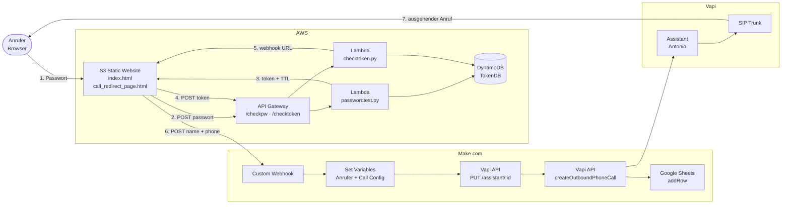
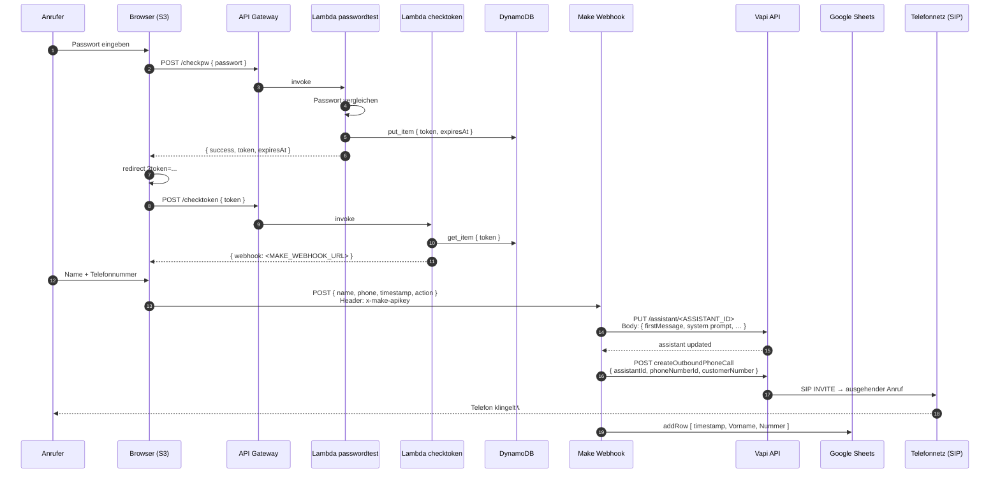
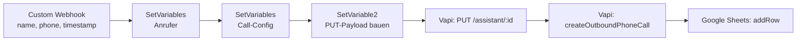

# Architektur — Anton Voice Agent

Ein passwortgeschütztes Web-Frontend, das einen ausgehenden Telefonanruf eines KI-Stimmklons auslöst. Der Anrufer hinterlässt Name und Telefonnummer; wenige Sekunden später klingelt sein Telefon und „Antonio" (mein Stimmklon) beantwortet Fragen zu meinem Lebenslauf.

> **Hinweis:** Alle in diesem Dokument gezeigten IDs, Tokens, URLs und Schlüssel sind durch Platzhalter ersetzt (`<…>`, `***`). Konkrete Werte liegen in den jeweiligen Cloud-Konfigurationen, nicht im Repo.

---

## 1. High-Level Architektur



---

## 2. Komponenten

| # | Komponente | Technologie | Verantwortlichkeit |
|---|------------|-------------|--------------------|
| 1 | Frontend  | Static HTML/JS auf **AWS S3** | Passwort-Login, Name/Telefon-Formular |
| 2 | Auth-API  | **AWS API Gateway** (HTTP API) | Öffentliche Endpunkte `/checkpw`, `/checktoken` |
| 3 | Passwort-Check | **AWS Lambda** (Python) | Passwort prüfen, Token generieren |
| 4 | Token-Check    | **AWS Lambda** (Python) | Token validieren, Webhook ausliefern |
| 5 | Token-Store    | **AWS DynamoDB** (`TokenDB`) | Kurzlebige Tokens (TTL 60 s) |
| 6 | Orchestrierung | **Make.com** Scenario | Personalisiert Assistant, löst Anruf aus, loggt |
| 7 | Voice Agent    | **Vapi** + ElevenLabs + OpenAI + Deepgram | Stimme, LLM, STT, Wissensbasis |
| 8 | Telefonie      | **Vapi SIP Trunk** | Ausgehender PSTN-Anruf |
| 9 | Logging        | **Google Sheets** | Timestamp, Vorname, Nummer pro Anruf |

---

## 3. End-to-End Flow (Sequenz)



---

## 4. Komponenten im Detail

### 4.1 Frontend (AWS S3)

Zwei statische Seiten, kein Backend im Browser. Die gesamte Logik sind `fetch`-Aufrufe.

**`index.html` — Passwort-Login**

```js
// Auszug — sanitiert
async function validatePassword(password) {
  const apiUrl = "<API_GATEWAY_URL>/checkpw";
  const response = await fetch(apiUrl, {
    method: "POST",
    headers: { "Content-Type": "application/json" },
    body: JSON.stringify({ passwort: password })
  });
  const data = await response.json();
  return {
    success: data.success === true,
    token: data.token,
    expiresAt: data.expiresAt
  };
}
```

Bei Erfolg wird auf die Anruf-Seite mit dem Token als Query-Param weitergeleitet:

```js
window.location.href = `call_redirect_page.html?token=${encodeURIComponent(token)}`;
```

**`call_redirect_page.html` — Anruf-Formular**

Beim Laden wird der Token serverseitig validiert. Antwort liefert die Make-Webhook-URL erst dann zurück, wenn der Token gültig ist — das versteckt die URL vor unautorisierten Besuchern.

```js
async function validateToken(token) {
  const response = await fetch("<API_GATEWAY_URL>/checktoken", {
    method: "POST",
    headers: { "Content-Type": "application/json" },
    body: JSON.stringify({ token })
  });
  const result = await response.json();
  return result === false ? { valid: false } : { valid: true, webhook: result.webhook };
}
```

Anschließend wird mit Name und Telefonnummer der Make-Webhook getriggert:

```js
const payload = {
  name: name.trim(),
  phone: phone.trim(),       // bereits mit Ländervorwahl +49
  timestamp: new Date().toISOString(),
  action: "initiate_call"
};

await fetch(webhookUrl, {
  method: "POST",
  headers: {
    "Content-Type": "application/json",
    "x-make-apikey": "<MAKE_API_KEY>"
  },
  body: JSON.stringify(payload)
});
```

---

### 4.2 Auth-Lambdas

Zwei kleine Python-Lambdas hinter API Gateway.

**`passwordtest.py` — generiert Einmal-Token**

```python
# Auszug — sanitiert
import json, secrets, time, boto3

def lambda_handler(event, context):
    body = json.loads(event.get("body", "{}"))
    eingabe = body.get("passwort", "")
    korrektes_passwort = os.environ["APP_PASSWORD"]   # nicht hardcoded!
    ist_korrekt = (eingabe == korrektes_passwort)

    response = {"success": ist_korrekt}

    if ist_korrekt:
        token = secrets.token_hex(16)
        expires_at = int(time.time()) + 60   # 60 s TTL

        boto3.resource("dynamodb").Table("TokenDB").put_item(
            Item={"token": token, "expiresAt": expires_at}
        )
        response["token"] = token
        response["expiresAt"] = expires_at

    return {
        "statusCode": 200,
        "headers": {"Access-Control-Allow-Origin": "*"},
        "body": json.dumps(response)
    }
```

**`checktoken.py` — liefert die Make-Webhook-URL**

```python
# Auszug — sanitiert
import json, time, boto3, os

dynamodb = boto3.resource("dynamodb").Table("TokenDB")
WEBHOOK_URL = os.environ["MAKE_WEBHOOK_URL"]

def lambda_handler(event, context):
    token = json.loads(event.get("body", "{}")).get("token")
    item = dynamodb.get_item(Key={"token": token}).get("Item")

    if item and int(item["expiresAt"]) > int(time.time()):
        return {
            "statusCode": 200,
            "headers": {"Access-Control-Allow-Origin": "*"},
            "body": json.dumps({"webhook": WEBHOOK_URL})
        }
    return {"statusCode": 200, "body": json.dumps("false")}
```

**Warum dieser Token-Mechanismus?**
- Die Make-Webhook-URL ist nicht im Quelltext zu sehen.
- Token läuft nach 60 s ab → Replay-Angriffe sind zeitlich eng begrenzt.
- Das Passwort wird nie im Browser persistiert.

---

### 4.3 Make.com Orchestrierung

Das Make-Scenario hat **6 Module**, sequenziell:



1. **Custom Webhook** — Eingang vom Frontend (`name`, `phone`, `timestamp`, `action`).
2. **Anrufer-Variablen** — `Vorname`, `Nummer` aus dem Payload zwischenspeichern.
3. **Call-Variablen** — Vapi-IDs, `firstMessage` (personalisiert mit Vorname), System-Prompt.
4. **JSON-Payload** für den Assistant-Update zusammenbauen.
5. **Vapi PUT /assistant/`<ID>`** — Assistant wird personalisiert (Begrüßung enthält den Vornamen).
6. **Vapi createOutboundPhoneCall** — startet den Anruf.
7. **Google Sheets `addRow`** — Logging im Sheet `CallBase` (Spalten: Timestamp, Vorname, Nummer).

---

### 4.4 Vapi Assistant Update — API Call

```http
PUT https://api.vapi.ai/assistant/<ASSISTANT_ID>
Authorization: Bearer <VAPI_API_KEY>
Content-Type: application/json
```

```json
{
  "name": "Anton",
  "firstMessage": "Hi {{Vorname}}, hier spricht Antonio, der Stimmklon von Anton. Freut mich, dich kennenzulernen!",
  "endCallFunctionEnabled": true,
  "voice": {
    "provider": "11labs",
    "model": "eleven_turbo_v2_5",
    "voiceId": "<ELEVENLABS_CLONED_VOICE_ID>",
    "stability": 0.5,
    "similarityBoost": 0.75
  },
  "model": {
    "provider": "openai",
    "model": "chatgpt-4o-latest",
    "messages": [
      { "role": "system", "content": "<SYSTEM_PROMPT>" }
    ],
    "knowledgeBase": {
      "provider": "google",
      "fileIds": ["<CV_FILE_ID>", "<INTERESTS_FILE_ID>"]
    }
  },
  "transcriber": {
    "provider": "deepgram",
    "model": "nova-2",
    "language": "de"
  },
  "firstMessageMode": "assistant-waits-for-user",
  "voicemailDetection": {
    "provider": "vapi",
    "backoffPlan": { "maxRetries": 6, "startAtSeconds": 5, "frequencySeconds": 5 }
  }
}
```

### 4.5 Vapi Outbound Call — API Call

```http
POST https://api.vapi.ai/call
Authorization: Bearer <VAPI_API_KEY>
Content-Type: application/json
```

```json
{
  "assistantId": "<ASSISTANT_ID>",
  "phoneNumberId": "<VAPI_PHONE_NUMBER_ID>",
  "customer": { "number": "+49<RUFNUMMER>" }
}
```

Vapi initiiert daraufhin den ausgehenden Anruf über den konfigurierten **SIP Trunk** an die PSTN-Rufnummer des Nutzers.

### 4.6 Google Sheets Logging

```
| Timestamp                  | Vorname | Nummer       |
|----------------------------|---------|--------------|
| 2025-01-01T19:00:00.123Z   | Mika    | +4916751…    |
```

Spreadsheet `VoiceAgent Calls`, Sheet `CallBase`. Wird nach jedem Anruf-Trigger ergänzt.

---

## 5. Stack auf einen Blick

| Layer        | Tooling                              |
|--------------|--------------------------------------|
| Hosting      | AWS S3 (static)                      |
| API          | AWS API Gateway (HTTP)               |
| Compute      | AWS Lambda (Python 3.x)              |
| Storage      | AWS DynamoDB                         |
| Orchestrierung | Make.com                           |
| Voice / LLM  | Vapi (Orchestration) + OpenAI GPT-4o + ElevenLabs (TTS, geklonte Stimme) + Deepgram nova-2 (STT) |
| Telefonie    | Vapi-managed SIP Trunk → PSTN        |
| Logging      | Google Sheets                        |

---

## 6. Sicherheits-Design

- **Passwortgeschützt**: Die Seite ist nur mit Passwort erreichbar (Schutz vor unbegrenzten Kosten).
- **Kurzlebige Tokens**: 60 s TTL in DynamoDB, dann ungültig.
- **Webhook nicht im Frontend-Bundle**: Wird erst nach erfolgreicher Token-Prüfung ausgeliefert.
- **Kein API-Key im Repo**: Alle Schlüssel und IDs leben außerhalb des Repos (Lambda Env Vars, Make Connections, Vapi Konto).

---

## 7. Mögliche Erweiterungen

- Telefon-Rate-Limit pro Anrufer (DDB + IP/Token-Counter), um Missbrauch weiter zu reduzieren.
- Transcript-Webhook von Vapi → zweite Lambda → Sheets/DB, um Gesprächsverläufe auszuwerten.
- Multilingualer Modus (Deepgram-Sprache + System-Prompt dynamisch wählen).
- Wechsel von Make.com auf eine dritte Lambda → weniger Vendor, mehr Kontrolle.
