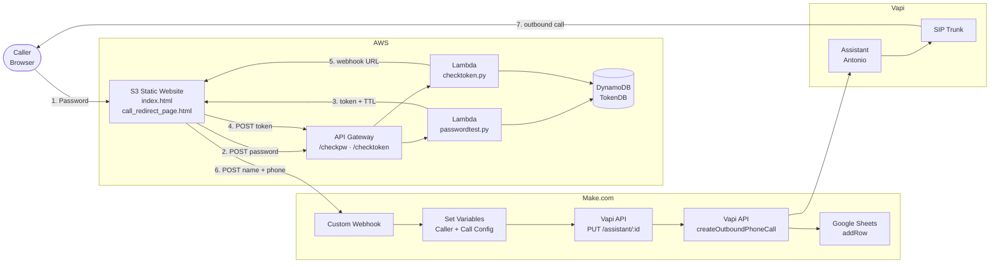

# Anton-Voice-Agent

This interactive voice agent (using my voice) will call you through the phone and answer questions about my CV.

Link: [https://www.antonschwarberg.de](https://www.antonschwarberg.de)

This page is password-protected for security reasons (otherwise I might end up with a high phone bill).
If you'd like to use the feature, just send me a quick message or check my CV for the password.

## Architecture



| Layer        | Tooling                              |
|--------------|--------------------------------------|
| Hosting      | AWS S3 (static)                      |
| API          | AWS API Gateway (HTTP)               |
| Compute      | AWS Lambda (Python)                  |
| Storage      | AWS DynamoDB                         |
| Orchestration | Make.com                            |
| Voice / LLM  | Vapi + OpenAI GPT-4o + ElevenLabs (cloned voice) + Deepgram |
| Telephony    | Vapi-managed SIP Trunk → PSTN        |
| Logging      | Google Sheets                        |

For the full architecture (sequence diagrams, API contracts, sanitized code excerpts, security design) see **[ARCHITECTURE.md](ARCHITECTURE.md)**.

## Repo Structure

```
.
├── ARCHITECTURE.md             # Detailed architecture documentation
├── Lambda/                     # AWS Lambda functions (Python)
│   ├── passwordtest.py         # Password check → token generation
│   └── checktoken.py           # Token validation → webhook delivery
├── Make.com/
│   └── voice-agent.blueprint.json   # Make scenario export (sanitized)
├── Vapi/
│   └── info.md                 # Vapi assistant configuration outline
├── website/
│   ├── index.html              # Password login page
│   └── call_redirect_page.html # Name + phone form
├── .env.example                # Required environment variables
└── .gitignore
```
